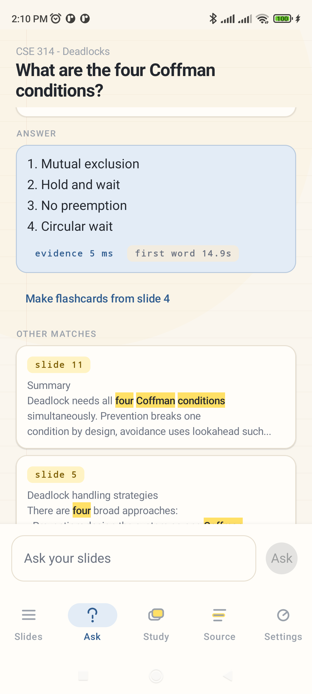
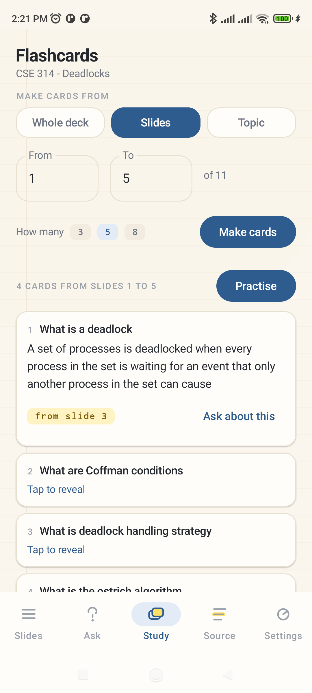
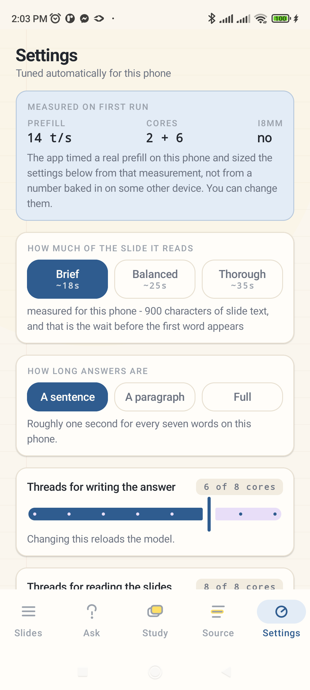
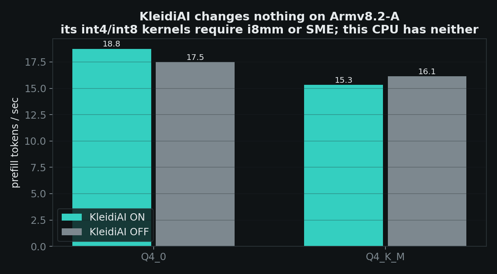
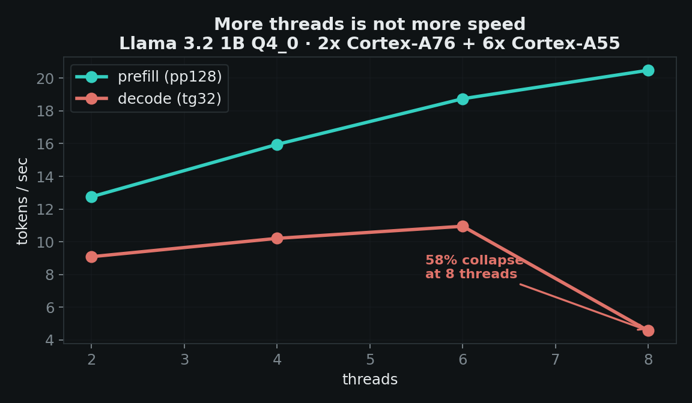
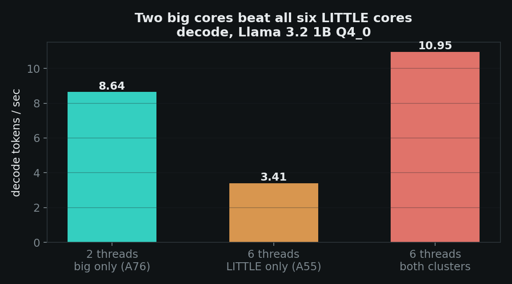

# Cram

**Ask your lecture slides a question and get an answer with the slide number, offline, on a 2020 budget phone.**

Open a PDF of a lecture. Ask it anything. Cram finds the passage that answers you, shows you which slide it came from, and writes the answer from that passage — no network, no account, no upload. Then it turns the same slides into flashcards you can revise from.

Built and measured on a **Poco M2 Pro** — Snapdragon 720G, 2× Cortex-A76 + 6× Cortex-A55, **Armv8.2-A with no i8mm, no SVE, no SME, no NPU path**, 6 GB RAM. Not a flagship. The phone most of the world is actually holding.

| | | |
|---|---|---|
|  |  |  |
| Answer, with the slide it came from | Cards made from the slides you chose | What it measured about your phone |

---

## The finding we'd tell every Arm developer

Arm markets **KleidiAI** as CPU acceleration for on-device AI. On this device it does nothing at all — and it says so in a log line nobody reads:

```
kleidiai: no compatible q4 kernels found for CPU features mask 1
kleidiai: no compatible q8 kernels found for CPU features mask 1
kleidiai: SME disabled
kleidiai: no kernel for tensor type q6_K, not accelerated by KleidiAI
          (kernels available for Q4_0 and Q8_0)
```

KleidiAI's int4/int8 microkernels require **i8mm or SME**. Armv8.2-A cores have dotprod and neither of those — so GGML silently falls back to generic kernels. We measured it rather than quoting it:

| Q4_0 weights | prefill tok/s | decode tok/s |
|---|---:|---:|
| KleidiAI **ON** | 18.75 | 8.82 |
| KleidiAI **OFF** | 17.48 | 9.17 |

Differences of ±7% **with no consistent sign** — decode is marginally *faster* with it off. That is run-to-run noise, not acceleration.

**The cliff falls straight through the mid-tier install base.** If you are deploying to Armv8.2-A phones, KleidiAI will not save you; the gains have to come from somewhere else.

The app tells you this about *your* phone, on the Settings screen, rather than asking you to take our word for it.

> **Scope, stated honestly:** the Q4_0/Q8_0 guidance *is* correct on i8mm or SME hardware. We are not saying KleidiAI doesn't work — we are saying it doesn't engage here, and "here" is a very large number of phones. Note too that even a "Q4_0" GGUF carries `q6_K` embedding and output tensors, so coverage would be partial even with i8mm.



---

## The measurement that shaped the whole app

On a desktop GPU, prefill (reading your prompt) runs 10–50× faster than decode (writing the answer). Every "just stuff more context in" RAG design assumes that ratio.

**On this CPU, prefill runs at roughly twice decode — about 14 ms per character of prompt.**

That single number rules out the standard approach. Retrieving eight passages and sending them all would cost half a minute before the first word appeared. So Cram is built the other way around:

- **Retrieve many, send few.** BM25 ranks every passage in the deck in **1–7 ms**; only the best one or two are ever paid for in tokens.
- **Greedy budget allocation.** The top passage takes as much of the character budget as it needs, and the runner-up gets whatever is left — rather than splitting evenly, which truncated the winner to make room for a passage that wasn't going to be used.
- **Evidence first.** The matching slide text appears while the model is still writing. The retrieval *is* the answer for most questions; the model is there to phrase it.

First word went from **34.5 s to ~11 s** — 3× — with retrieval itself never exceeding 7 ms.

### The app sizes itself to the phone it is on

A budget baked in on our device is wrong on every other one. At startup Cram times a real prefill and derives its own prompt budget from the result. The Settings screen shows the measurement, the values chosen from it, and lets you override them with the cost of each choice in seconds.

---

## Where the rest of the speed came from

### More threads is not more speed



| threads | prefill pp128 | decode tg32 |
|---:|---:|---:|
| 2 | 12.75 | 9.09 |
| 4 | 15.95 | 10.21 |
| 6 | 18.74 | **10.95** ← decode optimum |
| 8 | **20.48** ← prefill optimum | **4.57** ← **58% collapse** |

Two results worth carrying away:

1. **Using all 8 cores makes decode 58% slower than using 6.** Every layer ends in a barrier, so the two fast A76s spend their time waiting on the six slow A55s. Adding cores adds stalls.
2. **Prefill and decode want opposite thread counts** — prefill is compute-bound and scales to 8, decode is memory-bound and peaks at 6. llama.cpp exposes both (`n_threads`, `n_threads_batch`), so we run 6 and 8 respectively. This matters more here than in a chat app: reading the slides and writing the answer are separate phases of every single query.

### Two big cores beat all six little ones



The A76 pair delivers **2.5× the decode throughput of the entire A55 cluster** (8.64 vs 3.41 tok/s). This also corrected our own plan, which assumed decode belonged pinned to the big cluster. It doesn't: 6 unpinned threads (10.95) beat 2 pinned big threads (8.64), because the little cores do contribute real work at this model size.

> **A constraint worth knowing:** GGML fixes a thread pool's CPU affinity when the pool is created, and worker threads inherit it from whoever calls the load. Affinity must be set *before* the model loads, on the thread that will own it — and cannot be changed afterwards.

### Q4_0 over Q4_K_M — but not for the reason usually given

Q4_0 averages **18.1 tok/s prefill vs 15.7 for Q4_K_M (+15%)** — and that holds with KleidiAI *disabled in both*. The gain comes from **GGML's own aarch64 weight-repack path** (`use_extra_bufts`), not from KleidiAI. Right answer, wrong reason in most write-ups.

---

## Getting the answer right, not just fast

A fast wrong answer at 2 a.m. is worse than a slow right one. Three things Cram does that a generic PDF chatbot does not:

**Headings are ranked, not just matched.** Slide decks are written as "title, then content", so a slide called *The four Coffman conditions* is almost certainly the answer to *what are the four Coffman conditions*. Plain BM25 ranked a short Summary slide above the real definition, because length normalisation punished the longer slide that actually held the list. Heading terms and list structure carry extra weight.

**The budget is floored, not minimised.** Tuning purely for speed drove the character budget down to ~400 — not enough to hold a four-item list, so the model answered quickly and *invented two of the four conditions*. The floor is now 900 characters, and the Settings ladder only climbs from there. Speed that costs correctness isn't a saving.

**Cards are checked before they're shown.** A card whose back merely restates its front teaches nothing, and a slide that is only a list of bare terms tempts a 1B model into producing exactly that. Those are dropped rather than padded out. Every card and every answer carries the slide it came from, so you can check the working.

The sample deck ships with the app, so the first thing you see is a real question answered from real slides.

---

## Try it

```bash
git clone --recursive https://github.com/ashfaqstu/cram-offline && cd cram-offline
./scripts/fetch_models.sh            # downloads + sha256-verifies weights (never committed)
cd android && ./gradlew :app:assembleRelease
adb install -r app/build/outputs/apk/release/app-release.apk
adb push ../models/Llama-3.2-1B-Instruct-Q4_0.gguf \
         /sdcard/Android/data/dev.omnitalk/files/
```

Models live in app-specific external storage, so there is no runtime permission and no 770 MB copy.

**Reproduce the benchmarks on your own Arm phone:** [docs/REPRODUCE.md](docs/REPRODUCE.md). Open an issue with your device's CSV and we'll add it to the table.

**Privacy is structural, not a promise.** The app declares no internet permission and no storage permission. It cannot send your documents anywhere, even by mistake.

---

## What we cut, and why

- **A vector database and an embedding model.** BM25 answers these decks in 1–7 ms. An embedding model would add a second model to load, hundreds of megabytes of RAM, and a prefill cost per chunk — to improve ranking on a corpus small enough that lexical overlap is already decisive.
- **Multi-turn chat.** Every retained turn is prompt tokens re-read at 14 ms per character. A study tool is asked questions, not engaged in conversation.
- **Mind maps.** A diagram is a lot of generated tokens for something a reader skims once; the slide list already gives the structure.
- **ExecuTorch** — no grammar-constrained decoding, and a ~1.9 GB RSS `.pte` does not fit safely in 6 GB.
- **Arm Performix** — it targets Neoverse server platforms, not phones.

---

## Licence

Apache-2.0 — see [LICENSE](LICENSE) and [NOTICE](NOTICE).

**Built with Llama.** Model weights are not redistributed; `scripts/fetch_models.sh` downloads and verifies them. llama.cpp and ggml are MIT; KleidiAI is Apache-2.0 and vendored under `third_party/` so the native build never needs the network. PDF text extraction uses PdfBox-Android (Apache-2.0).
