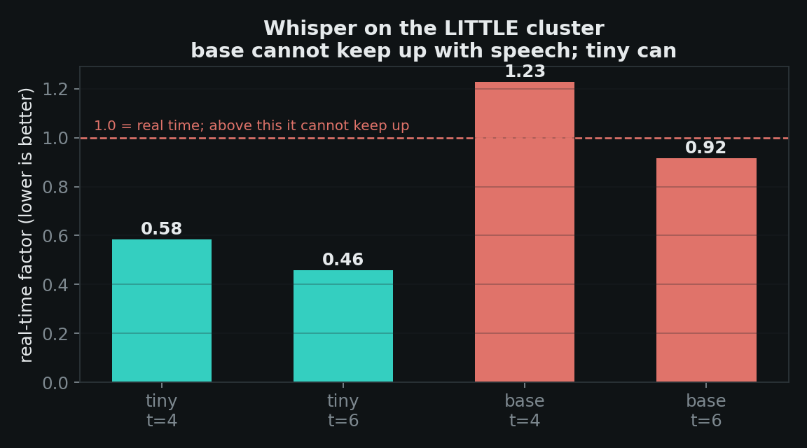

# OmniTalk Edge

**An offline AI agent that holds a goal-directed conversation in a language you don't speak — on a 2020 budget phone, in airplane mode, on the CPU.**

You give it a goal, not a sentence. *"Find out when the bus leaves, whether it has AC, and the price."* It speaks to the other person in their language, tracks which facts it still needs in a state machine, asks its own follow-up questions, and hands you an English summary.

Built and measured on a **Poco M2 Pro** — Snapdragon 720G, 2× Cortex-A76 + 6× Cortex-A55, **Armv8.2-A with no i8mm, no SVE, no SME, no NPU path**, 6 GB RAM. Not a flagship. The phone most of the world is actually holding.

---

## The finding we'd tell every Arm developer

Arm markets **KleidiAI** as CPU acceleration for on-device AI. On this device it does nothing at all — and it says so in a log line nobody reads:

```
kleidiai: no compatible q4 kernels found for CPU features mask 1
kleidiai: no compatible q8 kernels found for CPU features mask 1
kleidiai: SME disabled
kleidiai: no kernel for tensor type q6_K, not accelerated by KleidiAI
          (kernels available for Q4_0 and Q8_0)
```

KleidiAI's int4/int8 microkernels require **i8mm or SME**. Armv8.2-A cores have dotprod and neither of those — so GGML silently falls back to generic kernels. We measured it rather than quoting it:

| Q4_0 weights | prefill tok/s | decode tok/s |
|---|---:|---:|
| KleidiAI **ON** | 18.75 | 8.82 |
| KleidiAI **OFF** | 17.48 | 9.17 |

Differences of ±7% **with no consistent sign** — decode is marginally *faster* with it off. That is run-to-run noise, not acceleration.

**The cliff falls straight through the mid-tier install base.** If you are deploying to Armv8.2-A phones, KleidiAI will not save you; the gains have to come from somewhere else.

> **Scope, stated honestly:** the Q4_0/Q8_0 guidance *is* correct on i8mm or SME hardware. We are not saying KleidiAI doesn't work — we are saying it doesn't engage here, and "here" is a very large number of phones. Note too that even a "Q4_0" GGUF carries `q6_K` embedding and output tensors, so coverage would be partial even with i8mm.


---

## Where the speed actually came from

### More threads is not more speed


| threads | prefill pp128 | decode tg32 |
|---:|---:|---:|
| 2 | 12.75 | 9.09 |
| 4 | 15.95 | 10.21 |
| 6 | 18.74 | **10.95** ← decode optimum |
| 8 | **20.48** ← prefill optimum | **4.57** ← **58% collapse** |

Two results worth carrying away:

1. **Using all 8 cores makes decode 58% slower than using 6.** Every layer ends in a barrier, so the two fast A76s spend their time waiting on the six slow A55s. Adding cores adds stalls.
2. **Prefill and decode want opposite thread counts** — prefill is compute-bound and scales to 8, decode is memory-bound and peaks at 6. llama.cpp exposes both (`n_threads`, `n_threads_batch`), so we run 6 and 8 respectively.

### Two big cores beat all six little ones


The A76 pair delivers **2.5× the decode throughput of the entire A55 cluster** (8.64 vs 3.41 tok/s). This also corrected our own plan, which assumed decode belonged pinned to the big cluster. It doesn't: 6 unpinned threads (10.95) beat 2 pinned big threads (8.64), because the little cores do contribute real work at this model size.

### The clusters genuinely run in parallel

This is the result the whole architecture rests on:

| | prefill | decode |
|---|---:|---:|
| LLM alone, big cluster | 12.89 | 8.74 |
| LLM on big **+ Whisper hammering the LITTLE cluster** | 12.91 | 8.72 |

**99.8% of solo throughput.** Running speech recognition on the A55s costs the language model essentially nothing — so ASR can transcribe *while the user is still speaking* rather than after.

### Speech recognition has to be `tiny`



| model | threads | RTF |
|---|---:|---:|
| tiny q5_1 | 6 | **0.459** ✅ |
| base q5_1 | 6 | 0.915 ❌ |

`base` is technically under real time but has no headroom — it would fall behind the moment the CPU warms up or the LLM contends for cache. We ship `tiny` and record the accuracy cost in [docs/LANGUAGES.md](docs/LANGUAGES.md).

### Q4_0 over Q4_K_M — but not for the reason usually given

Q4_0 averages **18.1 tok/s prefill vs 15.7 for Q4_K_M (+15%)** — and that holds with KleidiAI *disabled in both*. The gain comes from **GGML's own aarch64 weight-repack path** (`use_extra_bufts`), not from KleidiAI. Right answer, wrong reason in most write-ups.

---

## Architecture — HetPipe

A 2 big + 6 LITTLE split is an awkward shape. Give every thread to one model and most of the chip idles; give all 8 threads to decode and it gets *slower*. HetPipe treats the clusters as two pools:

```
NAIVE                                         time ──►
 record ████████
                ASR ██████
                          prefill ███
                                     decode ████████
                                                     TTS ███ ▶

HETPIPE
 record ████████
   LITTLE  ASR ▓▓ ▓▓ ▓▓ ▓▓   (chunked, during capture)
   BIG          prefill ▓▓▓▓▓ (speculative, on partial transcript)
   BIG                  decode ████
   TTS                    ▶ speaks as soon as the question is complete
```

| Worker | Cores | Threads |
|---|---|---|
| ASR (whisper.cpp) | pinned LITTLE `0x3F` | 6 |
| LLM (llama.cpp) | unpinned | 6 decode / 8 prefill |

> **A constraint worth knowing:** GGML fixes a thread pool's CPU affinity when the pool is created, and worker threads inherit it from whoever calls the load. Affinity must therefore be set *before* the model loads, on the thread that will own it — and it cannot be changed afterwards. Our original design called for switching the LLM to all-core once ASR finished; that is not possible, and the code says so where it would otherwise look like an omission.

Latency work beyond scheduling:

- **Grammar field order is an optimization.** The GBNF emits `q` (the question) *first*, so TTS can start after ~12 tokens instead of ~60. At ~9 tok/s, putting the slots first would delay speech by roughly 5 seconds.
- **Single-letter JSON keys.** `"next_question"` costs ~4 tokens per turn; `"q"` costs 1.
- **The static prompt prefix is pre-warmed** while the user picks an objective, so turn 1 prefills ~40 tokens instead of ~250.
- **KV cache is retained across turns** — only new text is prefilled.

---

## Try it

```bash
git clone --recursive https://github.com/<you>/omnitalk-edge && cd omnitalk-edge
./scripts/fetch_models.sh            # downloads + sha256-verifies weights (never committed)
cd android && ./gradlew :app:assembleRelease
adb install -r app/build/outputs/apk/release/app-release.apk
adb push ../models/Llama-3.2-1B-Instruct-Q4_0.gguf ../models/ggml-tiny-q5_1.bin \
         /sdcard/Android/data/dev.omnitalk/files/
```

Models live in app-specific external storage, so there is no runtime permission and no 770 MB copy.

**Reproduce the benchmarks on your own Arm phone:** [docs/REPRODUCE.md](docs/REPRODUCE.md). Open an issue with your device's CSV and we'll add it to the table.

The app reports what it detects about your silicon on launch — core split, clock, `dotprod`/`i8mm`, and whether KleidiAI can engage at all.

---

## What we cut, and why

- **Camera OCR** — a multi-day Paddle-Lite integration contributing nothing to the optimization thesis.
- **A bundled neural TTS (Piper / sherpa-onnx)** — TTS is not our optimization target; the platform engine is genuinely on-device and costs a day less.
- **ExecuTorch** — no grammar-constrained decoding, and a ~1.9 GB RSS `.pte` does not fit safely in 6 GB.
- **Arm Performix** — it targets Neoverse server platforms, not phones.

---

## Licence

Apache-2.0 — see [LICENSE](LICENSE) and [NOTICE](NOTICE).

**Built with Llama.** Model weights are not redistributed; `scripts/fetch_models.sh` downloads and verifies them. llama.cpp, whisper.cpp and ggml are MIT; KleidiAI is Apache-2.0 and vendored under `third_party/` so the native build never needs the network.
